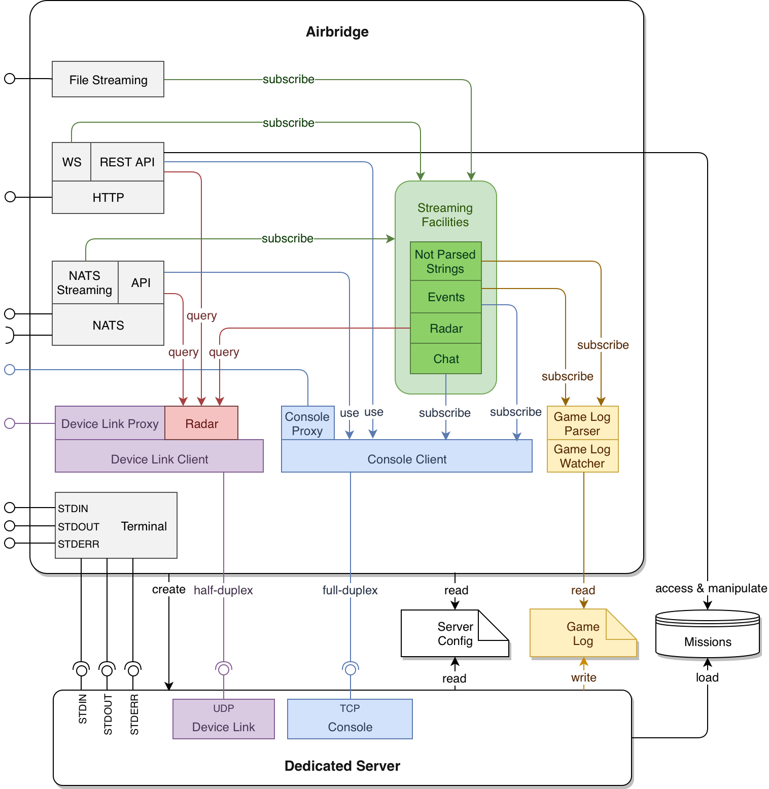
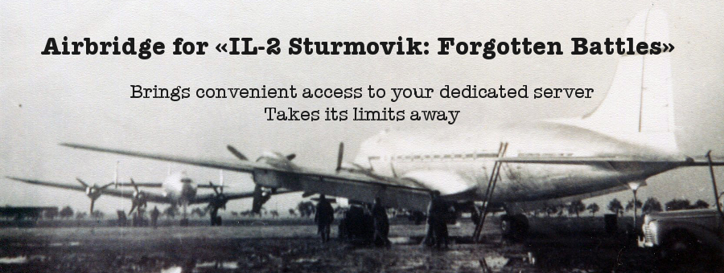

IL-2 FB Dedicated Server Airbridge
===================================

|python_versions| |license| |code_climate| |codebeat| |codacy| |scrutinizer|

|logo|

**Table of Contents**

.. contents::
    :local:
    :depth: 1
    :backlinks: none

Synopsis
--------

Airbridge is an application which wraps dedicated server of
«IL-2 Sturmovik: Forgotten Battles» aviasimulator.

It acts as additional access layer on top of dedicated server and provides
high-level API with ability to subscribe to game events. Airbridge makes it
possible to communicate with dedicated server by exchanging structured messages
instead of raw strings and packages.

This means that you can access server's console, device link and mission
storage in a unified way. Also it's possible to subscribe to the stream of
parsed game events easily.

Airbridge allows totally remote access to dedicated server without need to
bother about access to server's file system. This allows to escape limitations
on location of supplementary software and server commanders: dedicated server
and 3rd-party software can now run on different machines and under different
operating systems.

All that brings much easier server's API and more pleasant development
experience.

Premises
--------

// TODO:

Architecture Overview
---------------------

// TODO:

// TODO:

Features Overview
-----------------

// TODO:

Installation
------------

// TODO:

Configuration
-------------

// TODO:

Usage
-----

// TODO:

Caveats
-------

// TODO:

FAQ
---

// TODO:

Changelog
---------

// TODO:

.. |python_versions| image:: https://img.shields.io/badge/Python-3.6-brightgreen.svg?style=flat
   :alt: Supported versions of Python

.. |license| image:: https://img.shields.io/badge/license-MIT-blue.svg?style=flat
   :target: https://github.com/IL2HorusTeam/il2fb-ds-airbridge/blob/master/LICENSE
   :alt: MIT license

.. |code_climate| image:: https://codeclimate.com/github/IL2HorusTeam/il2fb-ds-airbridge/badges/gpa.svg
   :target: https://codeclimate.com/github/IL2HorusTeam/il2fb-ds-airbridge
   :alt: Code quality provided by «Code Climate»

.. |codebeat| image:: https://codebeat.co/badges/82cf3629-2f6b-4a96-8585-c8241455b8e3
    :target: https://codebeat.co/projects/github-com-il2horusteam-il2fb-ds-airbridge-master
    :alt: Code quality provided by «Codebeat»

.. |codacy| image:: https://api.codacy.com/project/badge/Grade/06e99f9bd40b43d8b95565a900654578?branch=master
   :target: https://www.codacy.com/app/oblalex/il2fb-ds-airbridge
   :alt: Code quality provided by «Codacy»

.. |scrutinizer| image:: https://scrutinizer-ci.com/g/IL2HorusTeam/il2fb-ds-airbridge/badges/quality-score.png?b=master&style=flat
   :target: https://scrutinizer-ci.com/g/IL2HorusTeam/il2fb-ds-airbridge/?branch=master
   :alt: Code quality provided by «Scrutinizer CI»
